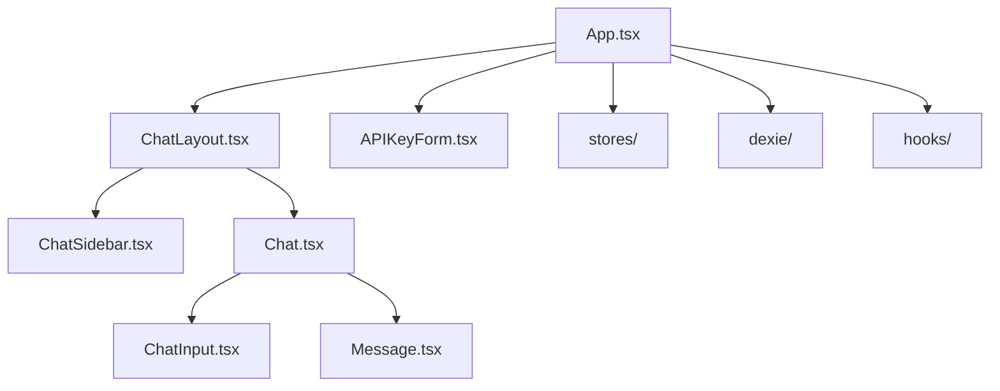
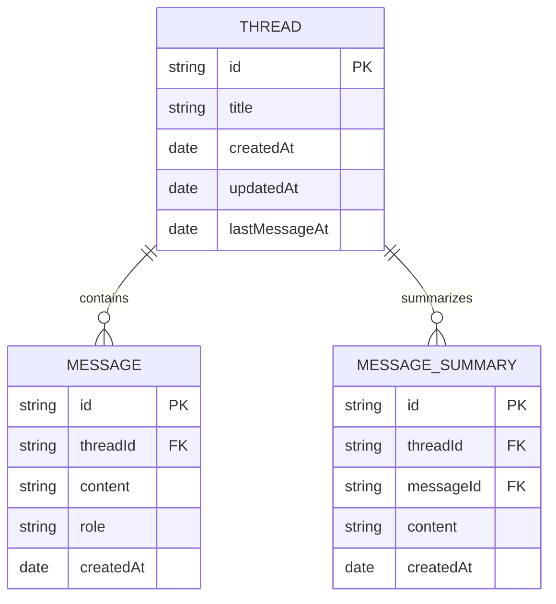

# Codebase Overview for lax

## Table of Contents

1. [Project Summary](#project-summary)
2. [High-Level Architecture (Mermaid)](#high-level-architecture)
3. [Key Features & Product Vision](#key-features--product-vision)
4. [Technical Stack](#technical-stack)
5. [Frontend Structure](#frontend-structure)
6. [Backend/API Structure](#backendapi-structure)
7. [Data Model & Persistence](#data-model--persistence)
8. [State Management](#state-management)
9. [Planned Features & TODOs](#planned-features--todos)
10. [Contribution & Development Workflow](#contribution--development-workflow)

---

## Project Summary

**lax** is a privacy-first, open-source AI chat application supporting multiple AI providers (OpenAI, Google Gemini, DeepSeek, etc.). All data is stored locally in the browser, and users bring their own API keys.

---

## Repository

https://github.com/Priyabhunia/me

---

## High-Level Architecture

```mermaid
flowchart TD
    subgraph Frontend [Frontend (React)]
        A1[App.tsx (Router)]
        A2[Components/]
        A3[Hooks/]
        A4[Dexie (IndexedDB)]
        A5[Stores (Zustand)]
    end
    subgraph Backend [Backend (Next.js API)]
        B1[api/chat/route.ts]
        B2[api/completion/route.ts]
    end
    subgraph External
        E1[OpenAI API]
        E2[Google Gemini API]
        E3[DeepSeek API]
    end

    A1 --> A2
    A1 --> A3
    A1 --> A4
    A1 --> A5
    A2 --> B1
    A2 --> B2
    B1 --> E1
    B1 --> E2
    B1 --> E3
    B2 --> E2
```

---

## Key Features & Product Vision

- **Privacy-first:** All chat data is stored locally (IndexedDB via Dexie).
- **Bring your own API key:** No server-side storage of user credentials.
- **Multi-model support:** Easily switch between AI providers.
- **Chat Navigator:** Quickly jump to any message.
- **Optimized React codebase:** Minimal re-renders, modular components.
- **Planned:** Attachments, chat history search, resumable streams, error handling.

---

## Technical Stack

- **Frontend:** React 19, React Router, Zustand (state), Dexie (IndexedDB), Tailwind CSS, Radix UI, React Hook Form
- **Backend:** Next.js API routes (serverless), ai-sdk, OpenAI/Google/DeepSeek SDKs
- **Other:** TypeScript, ESLint, SWR, Zod, pnpm

---

## Frontend Structure



- **Routing:** `frontend/app.tsx` uses React Router for navigation.
- **Components:** Modular, with separation between UI (in `components/ui/`) and logic.
- **State:** Managed via Zustand stores (`APIKeyStore`, `ModelStore`).
- **Persistence:** Dexie for local IndexedDB storage (`db.ts`, `queries.ts`).
- **Hooks:** Custom hooks for navigation, message summaries, and UI logic.

---

## Backend/API Structure

- **API Endpoints:** Located in `app/api/`
    - `/chat`: Streams chat responses from selected AI provider.
    - `/completion`: Generates chat titles using Google Gemini.
- **Provider Abstraction:** Models and API keys are abstracted in `lib/models.ts`.
- **Security:** API keys are passed via headers; not stored server-side.

---

## Data Model & Persistence



- **Threads:** Each chat session.
- **Messages:** Linked to threads, with roles (user, assistant, system, data).
- **Summaries:** For quick navigation/search.

---

## State Management

- **Zustand stores:** For API keys, model selection, and global state.
- **Dexie:** For persistent chat/thread storage.
- **React Context/Hooks:** For UI state and logic abstraction.

---

## Planned Features & TODOs

- **Sync Dexie across tabs**
- **Error handling in Dexie**
- **Chat history search**
- **Attachments (Image, PDF)**
- **History card view**
- **Scroll to bottom button**
- **Resumable stream with Redis (future server-side support)**

---

## Contribution & Development Workflow

- **Install:** `pnpm install`
- **Run:** `pnpm dev`
- **Contribute:** Fork, branch, PR
- **Lint:** `pnpm lint`
- **Build:** `pnpm build`

---

## Product Manager's View

- **User Value:** Privacy, flexibility, and speed.
- **Differentiators:** Local storage, multi-provider, open-source.
- **Roadmap:** Focus on usability (search, attachments), reliability (sync, error handling), and extensibility (more models/providers).

---

## Software Architect's View

- **Separation of concerns:** Clear split between UI, state, persistence, and API.
- **Extensibility:** Easy to add new AI providers/models.
- **Security:** No sensitive data leaves the client.
- **Scalability:** Ready for future server-side features (e.g., Redis streaming).

---

## Software Developer's View

- **Modern stack:** React 19, Next.js, TypeScript, Zustand, Dexie.
- **Component-driven:** Reusable, testable UI.
- **API abstraction:** Easy to swap/add providers.
- **Local-first:** Fast, reliable, and private.

---

*This document is auto-generated for deep onboarding and ongoing reference. For further details, see the codebase and inline comments.* 